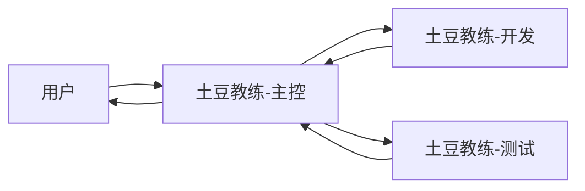

# 会话工作流

## 角色



主控负责决策和验收入口，开发负责实现，测试负责独立验证。

## 标准流程

1. 用户在主控会话提出目标。
2. 主控更新 `TASKS.md` 并写出可验收任务。
3. 主控向开发会话发送实现任务。
4. 开发提交文件清单、验证结果和风险。
5. 主控审查后向测试会话发送独立验收任务。
6. 测试输出通过、失败或阻塞，并记录复现步骤。
7. 失败项回到开发，修复后重新测试。
8. 主控更新文档和任务状态，再向用户汇总。

## 文件所有权

开发任务必须声明写入范围。测试会话可以写入：

```text
tests/
private/dev-docs/test-reports/
```

测试不得直接修改 `src/` 来让测试通过。

主控主要维护：

```text
README.md
TASKS.md
docs/requirements/
docs/architecture/
docs/decisions/
docs/roadmap/
```

## 交接格式

```text
任务：
状态：
修改文件：
验证：
风险：
下一步：
```

本机具体 Codex 任务标识只保存在本地协作配置中，不进入公开仓库。
